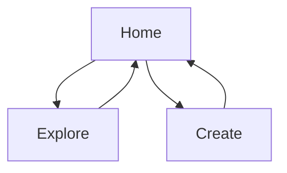

## 1. Product Overview
Add high-impact landing sections to your NFT marketplace Home page to improve first-time discovery and drive users into Explore/Create.
This scope is UI-first and keeps all data sources as-is (on-chain reads via the existing web3 setup).

## 2. Core Features

### 2.1 User Roles
| Role | Registration Method | Core Permissions |
|------|---------------------|------------------|
| Visitor | None | Can browse Home, navigate to Explore/Create, and view marketplace content. |
| Connected Wallet User | Connect wallet (wagmi) | Can mint/list and buy where the contract UI already supports it. |

### 2.2 Feature Module
Your landing UI requirements consist of the following main pages:
1. **Home**: hero + new landing sections (Featured Drops, Marketplace Stats, How It Works) and a final CTA strip.
2. **Explore**: marketplace feed with consistent loading/empty/error states.
3. **Create**: mint & list flow with wallet-required guard and transaction status.

### 2.3 Page Details
| Page Name | Module Name | Feature description |
|-----------|-------------|---------------------|
| Home | Global navigation | Navigate to `/explore` and `/create`; expose wallet connect affordance consistent with the rest of the app. |
| Home | Hero section | Present value proposition and show 2 CTAs (primary to Explore, secondary to Create). |
| Home | Featured Drops | Display a 3–6 item grid using existing NFT card visual language; show skeletons while loading. |
| Home | Marketplace Stats | Show 3 stat tiles (listed count, chain, contract address) with “—” placeholders when not available. |
| Home | How It Works | Explain the flow in 3 steps (Connect → Mint & List → Buy) with links to the relevant routes. |
| Home | Final CTA strip | Reinforce Explore/Create actions at the bottom of the page. |
| Explore | Marketplace feed | List items using the existing read method; provide loading/empty/error states. |
| Explore | Item interaction (existing capability) | Enable the primary existing item action (e.g., buy) only when wallet is connected and item is eligible; otherwise show disabled/educational state. |
| Create | Mint & list form | Collect NFT metadata already supported by the app; validate required fields before submit. |
| Create | Wallet guard + tx status | Require wallet connection and show Idle/Pending/Success/Error feedback for the transaction. |

## 3. Core Process
Visitor Flow:
- You land on Home, scan the Hero and landing sections, then click Explore to browse items.
- You can click Create, but any mint/list submission requires wallet connection.

Connected Wallet Flow:
- You connect your wallet from the global navigation.
- You browse Explore and perform existing eligible actions.
- You go to Create to mint/list and track transaction status.

> Note: This document supersedes `Landing_UI_Components_PRD.md`, which currently contains page-design content.