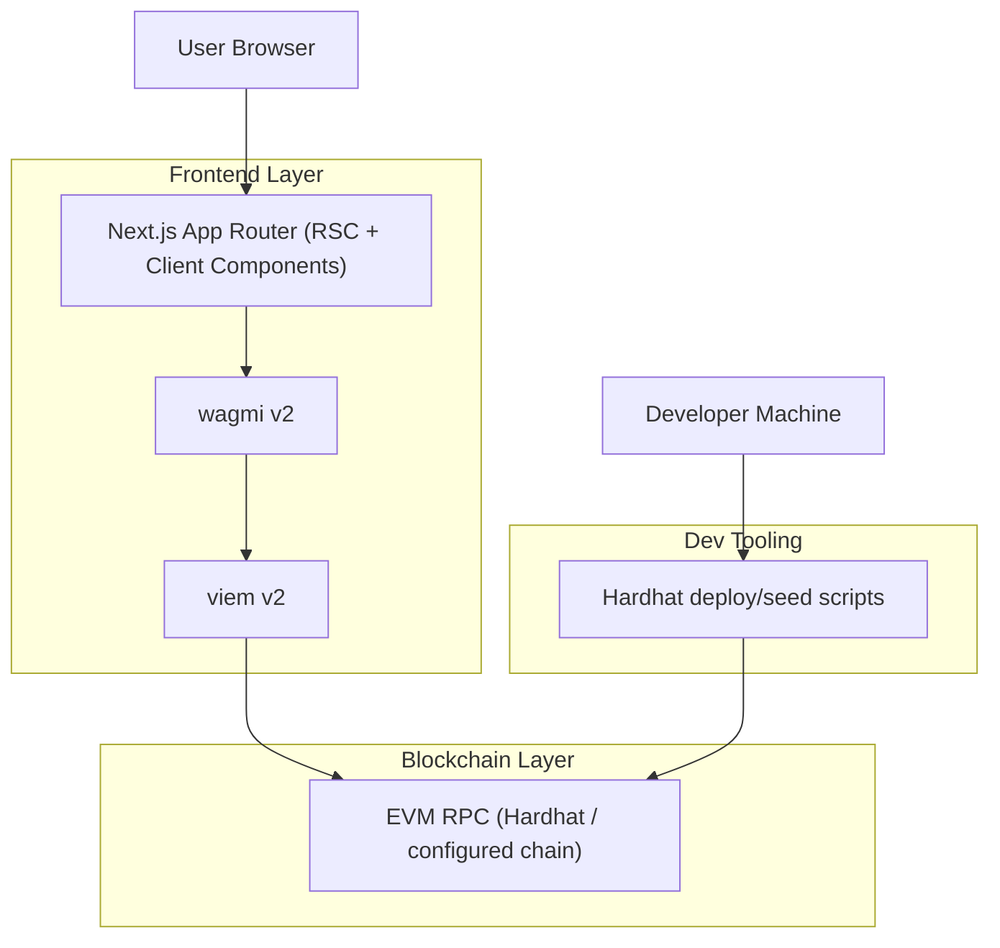

## 1.Architecture design

## 2.Technology Description
- Frontend: Next.js@15 + React@19 + tailwindcss@3 + TypeScript
- Web3: wagmi@2 + viem@2
- Data/cache: @tanstack/react-query@5 (via wagmi)
- Backend: None

## 3.Route definitions
| Route | Purpose |
|-------|---------|
| / | Home landing page composed of Hero + Featured Drops + Marketplace Stats + How It Works + final CTA strip |
| /explore | Marketplace feed and existing eligible item actions |
| /create | Mint & list flow (wallet required) |
| /dashboard | Wallet-centric overview (existing) |
| /profile | Placeholder (existing) |

## 4.API definitions (If it includes backend services)
N/A (no backend services).

## 5.Server architecture diagram (If it includes backend services)
N/A.

## 6.Data model(if applicable)
On-chain state only for this scope:
- Market items (tokenId, seller, owner, price)
- Chain + contract address (for Marketplace Stats display)
