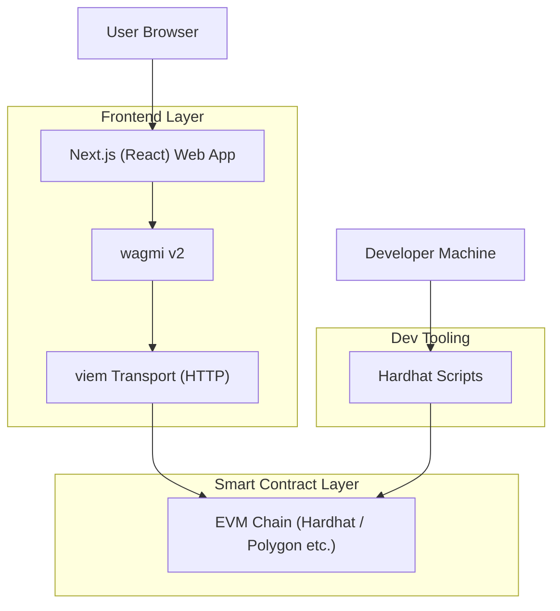

## 1.Architecture design

## 2.Technology Description
- Frontend: Next.js@15 + React@19 + tailwindcss@3
- Web3: wagmi@2 (hooks) + viem@2 (chains, types, parsing)
- State/Data: @tanstack/react-query@5 (via WagmiProvider + QueryClientProvider)
- Backend: None (direct chain reads/writes from the client)
- Contracts/dev: Hardhat@2 + @nomicfoundation/hardhat-toolbox (ethers) for deploy + seed scripts

## 3.Route definitions
| Route | Purpose |
|-------|---------|
| / | Home landing page; hero + 3 new landing UI components |
| /explore | Read-only marketplace feed; purchase from cards when eligible |
| /create | Mint and list an NFT by calling the marketplace contract |
| /dashboard | Wallet-centric view of owned NFTs and active listings |
| /profile | Placeholder page (currently “Coming soon”) |

## 4.API definitions (If it includes backend services)
N/A (no backend services).

## 5.Server architecture diagram (If it includes backend services)
N/A.

## 6.Data model(if applicable)
N/A (on-chain state only).

---

### Implementation Notes (scope-specific)
**A) Landing UI components (Home)**
- Implement as 3 new React components under `apps/web/src/components/landing/*` and render them from `apps/web/src/app/page.tsx`.
- Keep styling consistent with existing tokens: `bg-zinc-950`, `web3.cyan`, `web3.purple`, `shadow-glow`, frosted panels (`bg-white/5`, `border-white/10`).
- Use only wagmi v2 hooks + viem types/utils; do not add ethers/thirdweb/web3.js in the frontend.

**B) Home page composition update**
- Home should become a stacked layout: Hero → Featured Drops → Marketplace Stats → How It Works → final CTA row.
- Preserve existing primary CTAs to `/explore` and `/create`.

**C) Hardhat seed script (mint + list sample NFTs)**
- Add `packages/contracts/scripts/seed.ts`.
- Script responsibilities:
  - Load deployed marketplace address from `packages/contracts/deployments/<network>.json` (written by `scripts/deploy.ts`) OR accept `MARKETPLACE_ADDRESS` env override.
  - Read `listingFee = await contract.getListingFee()`.
  - Loop a small array of sample tokenURIs and prices; call `createToken(tokenUri, priceWei, { value: listingFee })`.
  - Log tx hash + resulting tokenId (if returned) for each mint.
- Recommend adding workspace script: `"seed:local": "hardhat run scripts/seed.ts --network localhost"`.
