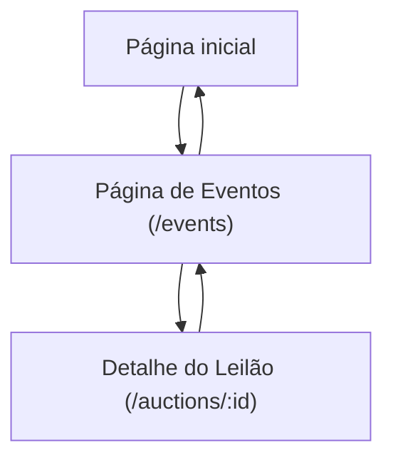

## 1. Product Overview
Produto para criar e participar de leilões on-chain e gerir eventos pessoais.
Permite acompanhar atividades do contrato (eventos on-chain) e organizar eventos privados por carteira.

## 2. Core Features

### 2.1 User Roles
| Role | Registration Method | Core Permissions |
|------|---------------------|------------------|
| Visitante | Sem cadastro; pode conectar carteira opcionalmente | Navegar eventos/leilões e ver detalhes/estado on-chain (somente leitura) |
| Usuário (carteira conectada) | Conexão de carteira (wagmi) | Criar/editar eventos pessoais; criar leilões; dar lances; finalizar/cancelar leilões que criou |

### 2.2 Feature Module
O produto consiste nas seguintes páginas principais:
1. **Página inicial**: visão geral, conectar carteira, atalhos para eventos e leilões ativos.
2. **Página de Eventos (/events)**: feed unificado (pessoais + on-chain), criar/editar evento pessoal, lista de leilões e status, acesso ao detalhe.
3. **Detalhe do Leilão (/auctions/:id)**: dados do leilão, histórico de lances, ação de lance, estados (aberto/finalizado/cancelado).

### 2.3 Page Details
| Page Name | Module Name | Feature description |
|-----------|-------------|---------------------|
| Página inicial | Conectar carteira | Conectar/desconectar carteira e exibir endereço atual e rede.
| Página inicial | Atalhos e destaques | Listar atalhos para “Eventos” e “Leilões ativos”; destacar 3–5 leilões mais recentes (via API/cache + leitura on-chain).
| Página de Eventos (/events) | Feed de eventos | Exibir feed em ordem cronológica com filtros por tipo (Pessoal / On-chain), por leilão e por período.
| Página de Eventos (/events) | Eventos pessoais (CRUD) | Criar, editar e remover evento pessoal (título, descrição, data/hora, tags, visibilidade) associado à carteira conectada.
| Página de Eventos (/events) | Leilões (lista) | Listar leilões (aberto/finalizado), com busca por ID/creator; abrir detalhe do leilão.
| Página de Eventos (/events) | Atualizações em tempo real | Atualizar feed/lista a partir do watcher (API) e leituras diretas via wagmi/viem (ex.: novo lance no detalhe).
| Detalhe do Leilão (/auctions/:id) | Resumo do leilão | Mostrar ativo/token (se aplicável), preço inicial, incremento mínimo, maior lance, criador, prazo, estado.
| Detalhe do Leilão (/auctions/:id) | Dar lance (bids) | Enviar transação de lance usando wagmi/viem; validar valor mínimo; exibir estados de pending/success/fail e hash.
| Detalhe do Leilão (/auctions/:id) | Histórico e eventos do contrato | Renderizar histórico de lances e eventos do contrato (AuctionCreated/BidPlaced/AuctionFinalized/AuctionCanceled) via API + leitura on-chain.
| Detalhe do Leilão (/auctions/:id) | Ações do criador | Permitir finalizar/cancelar conforme regras do contrato; atualizar UI ao confirmar no chain.

## 3. Core Process
**Fluxo do Usuário (carteira conectada)**
1. Conecta a carteira na Página inicial.
2. Vai para /events e cria um evento pessoal (salvo via API).
3. Ainda em /events, cria um leilão on-chain (transação) e o watcher passa a indexar os eventos do contrato.
4. Abre um leilão em /auctions/:id e dá lances (transações) usando wagmi/viem.
5. Observa atualizações: UI lê estado do contrato e também recebe dados normalizados do watcher via API.
6. Se for o criador, finaliza/cancela ao final (transação) e acompanha confirmação.

