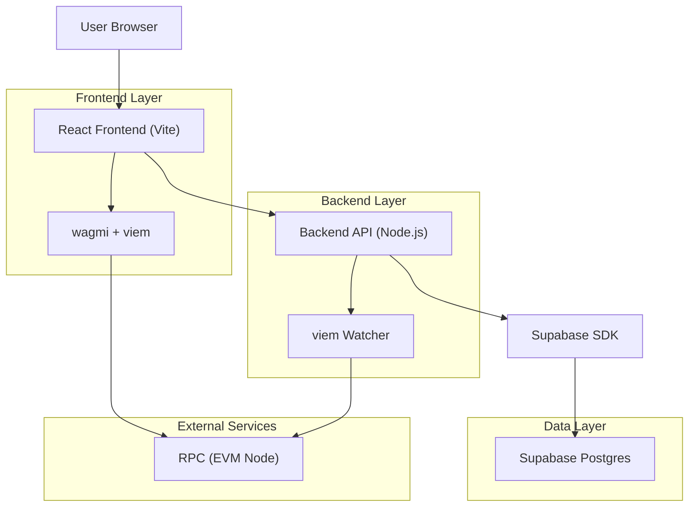
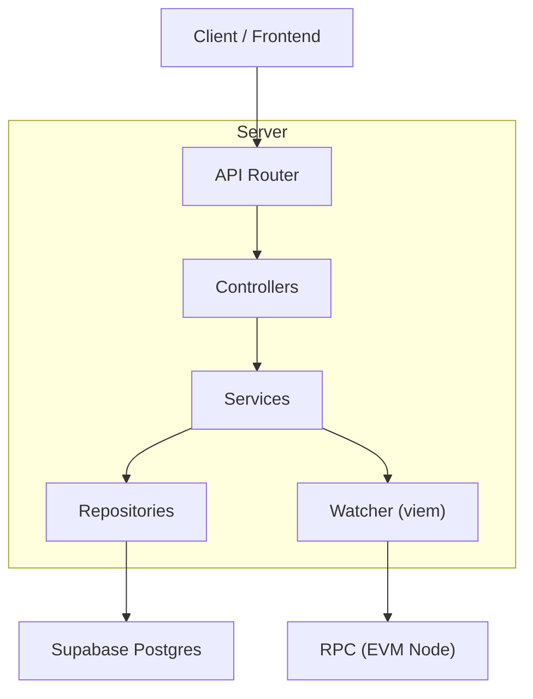
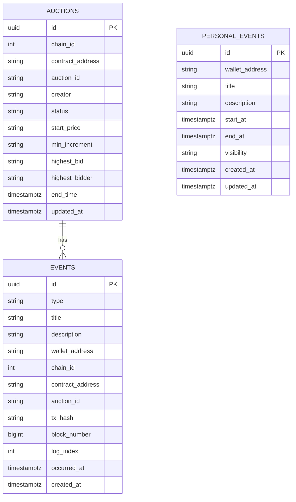

## 1.Architecture design


## 2.Technology Description
- Frontend: React@18 + vite + tailwindcss@3 + wagmi@2 + viem@2
- Backend: Node.js (Express@4 ou Fastify@4) + viem@2 + supabase-js@2
- Database: Supabase (PostgreSQL)

## 3.Route definitions
| Route | Purpose |
|-------|---------|
| / | Página inicial: conexão de carteira e atalhos para eventos/leilões |
| /events | Feed de eventos (pessoais + on-chain) e lista de leilões |
| /auctions/:id | Detalhe do leilão e interação de lances |

## 4.API definitions (If it includes backend services)
### 4.1 Core API
Eventos pessoais
```
GET /api/events?type=personal|onchain|all&from=&to=&auctionId=
POST /api/personal-events
PUT /api/personal-events/:id
DELETE /api/personal-events/:id
```
Leilões (visão normalizada/cache)
```
GET /api/auctions?status=active|ended&creator=
GET /api/auctions/:id
GET /api/auctions/:id/events
```

### 4.2 TypeScript types (shared)
```ts
export type EventType = "personal" | "onchain";

export type EventModel = {
  id: string;
  type: EventType;
  title: string; // p/ onchain: label do evento
  description?: string;
  walletAddress?: `0x${string}`; // dono do evento pessoal
  auctionId?: string; // referência lógica
  chainId?: number;
  txHash?: `0x${string}`;
  blockNumber?: bigint;
  occurredAt: string; // ISO
  createdAt: string; // ISO
};

export type AuctionModel = {
  id: string; // auctionId (do contrato) como string
  chainId: number;
  contractAddress: `0x${string}`;
  creator: `0x${string}`;
  status: "active" | "ended" | "canceled";
  startPrice: string; // em wei (string)
  minIncrement: string; // em wei (string)
  highestBid?: string; // em wei (string)
  highestBidder?: `0x${string}`;
  endTime: string; // ISO
  updatedAt: string; // ISO
};
```

### 4.3 Watcher (indexação)
- Conectar no RPC via viem e assinar logs do contrato (ex.: `watchContractEvent`).
- Normalizar eventos do contrato (AuctionCreated/BidPlaced/AuctionFinalized/AuctionCanceled) em registros `events`.
- Atualizar projeção em `auctions` (status, highestBid, highestBidder, endTime).
- Garantir idempotência por `(chainId, txHash, logIndex)`.

## 5.Server architecture diagram (If it includes backend services)


## 6.Data model(if applicable)
### 6.1 Data model definition


### 6.2 Data Definition Language
Auctions (auctions)
```
CREATE TABLE auctions (
  id UUID PRIMARY KEY DEFAULT gen_random_uuid(),
  chain_id INTEGER NOT NULL,
  contract_address TEXT NOT NULL,
  auction_id TEXT NOT NULL,
  creator TEXT NOT NULL,
  status TEXT NOT NULL CHECK (status IN ('active','ended','canceled')),
  start_price TEXT NOT NULL,
  min_increment TEXT NOT NULL,
  highest_bid TEXT,
  highest_bidder TEXT,
  end_time TIMESTAMPTZ NOT NULL,
  updated_at TIMESTAMPTZ NOT NULL DEFAULT NOW()
);

CREATE UNIQUE INDEX auctions_chain_contract_auction_id_ux
ON auctions (chain_id, contract_address, auction_id);

GRANT SELECT ON auctions TO anon;
GRANT ALL PRIVILEGES ON auctions TO authenticated;
```

On-chain events (events)
```
CREATE TABLE events (
  id UUID PRIMARY KEY DEFAULT gen_random_uuid(),
  type TEXT NOT NULL CHECK (type IN ('personal','onchain')),
  title TEXT NOT NULL,
  description TEXT,
  wallet_address TEXT,
  chain_id INTEGER,
  contract_address TEXT,
  auction_id TEXT,
  tx_hash TEXT,
  block_number BIGINT,
  log_index INTEGER,
  occurred_at TIMESTAMPTZ NOT NULL,
  created_at TIMESTAMPTZ NOT NULL DEFAULT NOW()
);

CREATE UNIQUE INDEX events_chain_tx_log_ux
ON events (chain_id, tx_hash, log_index);

CREATE INDEX events_occurred_at_idx ON events (occurred_at DESC);

GRANT SELECT ON events TO anon;
GRANT ALL PRIVILEGES ON events TO authenticated;
```

Eventos pessoais (personal_events)
```
CREATE TABLE personal_events (
  id UUID PRIMARY KEY DEFAULT gen_random_uuid(),
  wallet_address TEXT NOT NULL,
  title TEXT NOT NULL,
  description TEXT,
  start_at TIMESTAMPTZ NOT NULL,
  end_at TIMESTAMPTZ,
  visibility TEXT NOT NULL DEFAULT 'private' CHECK (visibility IN ('private','public')),
  created_at TIMESTAMPTZ NOT NULL DEFAULT NOW(),
  updated_at TIMESTAMPTZ NOT NULL DEFAULT NOW()
);

CREATE INDEX personal_events_wallet_start_idx
ON personal_events (wallet_address, start_at DESC);

GRANT SELECT ON personal_events TO anon;
GRANT ALL PRIVILEGES ON personal_events TO authenticated;
```
