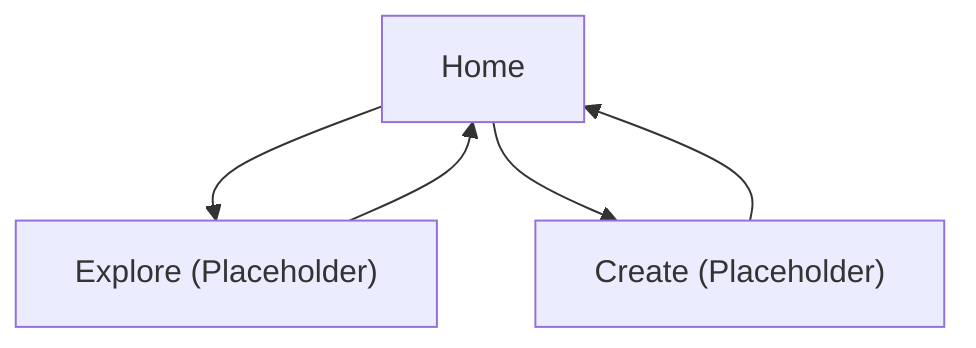

## 1. Product Overview
Set up the initial Next.js application shell and homepage for an NFT marketplace.
This phase delivers the baseline layout, navigation, and a Home hero section with clear calls-to-action.

## 2. Core Features

### 2.1 Feature Module
1. **Home**: root layout (NavBar + Footer), hero section, primary/secondary CTAs.
2. **Explore (Placeholder)**: simple “coming soon” content to validate navigation links.
3. **Create (Placeholder)**: simple “coming soon” content to validate navigation links.

### 2.2 Page Details
| Page Name | Module Name | Feature description |
|-----------|-------------|---------------------|
| Home | Root layout | Render consistent app shell with NavBar at top and Footer at bottom across routes. |
| Home | NavBar | Show brand/logo area, navigation links, and a “Connect Wallet” placeholder action. |
| Home | Footer | Show minimal footer content (copyright + basic links placeholders). |
| Home | Hero | Present value proposition headline, short supporting copy, and two CTAs. |
| Home | CTAs | Navigate user to Explore and Create placeholder routes. |
| Explore (Placeholder) | Placeholder content | Display “Explore — Coming soon” message and link back to Home. |
| Create (Placeholder) | Placeholder content | Display “Create — Coming soon” message and link back to Home. |

## 3. Core Process
User Flow:
- You land on Home, scan the hero content, and choose a CTA.
- You use the NavBar links to navigate to Explore/Create (placeholder pages for now).
- You see a “Connect Wallet” button placeholder (no wallet functionality in this phase).

