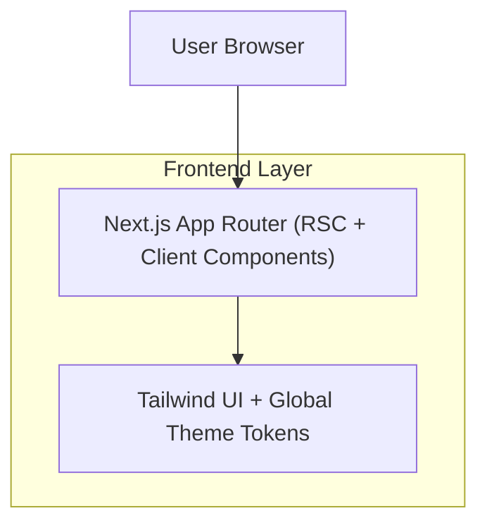

## 1.Architecture design

## 2.Technology Description

* Frontend: Next.js\@15 + React\@19 + TypeScript + tailwindcss\@3

* Backend: None (UI scaffold only)

## 3.Route definitions

| Route    | Purpose                                                              |
| -------- | -------------------------------------------------------------------- |
| /        | Home page with root layout (NavBar + Footer) and Hero section + CTAs |
| /explore | Placeholder page to validate navigation                              |
| /create  | Placeholder page to validate navigation                              |

## 4.API definitions (If it includes backend services)

N/A

## 5.Server architecture diagram (If it includes backend services)

N/A

## 6.Data model(if applicable)

N/A
