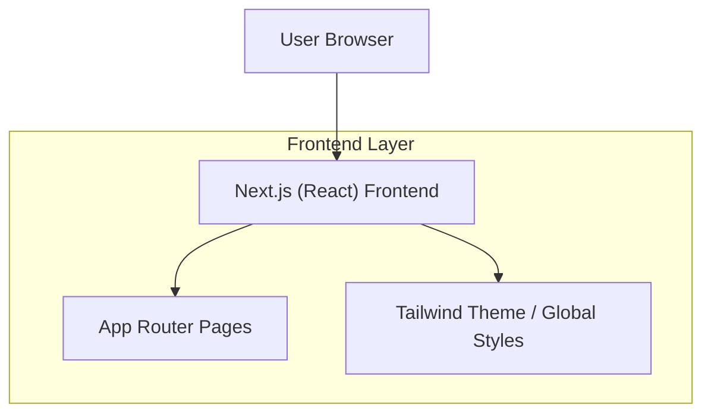

## 1.Architecture design

## 2.Technology Description
- Frontend: Next.js@15 (App Router) + React@18 + TypeScript + tailwindcss@3
- Backend: None (UI scaffold only)

## 3.Route definitions
| Route | Purpose |
|-------|---------|
| / | Home page with root layout, NavBar/Footer, hero + CTAs |
| /explore | Placeholder route for NavBar/CTA navigation validation |
| /create | Placeholder route for NavBar/CTA navigation validation |

## 4.API definitions (If it includes backend services)
N/A

## 5.Server architecture diagram (If it includes backend services)
N/A

## 6.Data model(if applicable)
N/A

### Implementation notes (Phase 3 Part 1)
- Root layout: implement `app/layout.tsx` to include `<NavBar />`, route content, and `<Footer />`.
- NavBar links: use `next/link` for client-side navigation; keep destinations to `/`, `/explore`, `/create`.
- Connect wallet placeholder: render as a button (no provider or wallet SDK hookup in this phase).
- Tailwind theme: define basic design tokens in `tailwind.config` (brand color, neutrals, typography scale) and use them in NavBar, hero, and CTA buttons.
- Home hero: implement as a reusable component (e.g., `components/HomeHero.tsx`) with heading, subcopy, and two CTA buttons linking to `/explore` and `/create`.