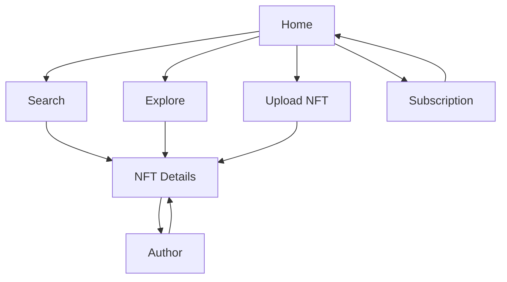

## 1. Product Overview
Add core discovery + detail flows to your NFT marketplace with 5 new pages (Search, NFT Details, Author, Upload NFT, Subscription).
All new UI follows the existing neon/frosted-glass style and stays SSR-safe for wallet-dependent rendering.

## 2. Core Features

### 2.1 User Roles
| Role | Registration Method | Core Permissions |
|------|---------------------|------------------|
| Visitor | None | Can browse Home/Explore/Search, view NFT details and author pages. |
| Connected Wallet User | Connect wallet (wagmi) | Can initiate on-chain actions where available (e.g., buy/list/mint if supported by the contract) and access Upload/Subscription actions. |

### 2.2 Feature Module
Your NFT marketplace requirements consist of the following main pages:
1. **Home**: neon hero + featured content sections, primary navigation, entry points to Search/Explore/Upload/Subscription.
2. **Search**: query input, optional filters, results grid, deep links to NFT Details and Author.
3. **NFT Details**: NFT media + metadata, ownership/listing status, primary action area (connect/buy/etc.).
4. **Author**: author header + wallet identity, grid of NFTs attributed to that author (created/listed/owned as available).
5. **Upload NFT**: asset + metadata form and a mint/list flow (client-side), wallet-required.
6. **Subscription**: plan cards + subscribe CTA (wallet-required), status display for connected wallet.

### 2.3 Page Details
| Page Name | Module Name | Feature description |
|-----------|-------------|---------------------|
| Home | Neon landing sections | Render Hero plus the listed landing UI components: Featured Drops, Marketplace Stats, How It Works, and a final CTA strip. |
| Home | Global navigation | Navigate to `/search`, `/explore`, `/upload-nft`, `/subscription` and show a wallet connect entry point. |
| Search | Search input | Enter query and submit to update results; keep query in URL (e.g., `?q=`) for shareable searches. |
| Search | Results grid | Render NFT cards matching query; show loading/empty/error states; link each item to `/nft-details/[id]`. |
| Search | Quick filters (optional) | Filter results by minimal criteria already available in UI (e.g., “Listed only”, “Price range” if price exists). |
| NFT Details | NFT presentation | Display media preview, name/description, token id, contract address, and attributes if present. |
| NFT Details | Ownership/listing state | Show seller/owner and listing price when available; render correct state for visitor vs connected wallet. |
| NFT Details | Primary action area | Enable the main action for the current state (connect wallet / buy / view on explorer); do not introduce unsupported actions. |
| Author | Author identity | Display author wallet address (truncated) and optional ENS if available; provide back navigation to Search/Explore. |
| Author | Author NFT grid | List NFTs related to the author (source depends on existing on-chain reads already used in the app); link to NFT Details. |
| Upload NFT | Upload form | Collect asset (file or URL), name, description, and price; validate required fields before allowing submission. |
| Upload NFT | Wallet guard | Require wallet connection before enabling submit; show SSR-safe placeholders before mount. |
| Upload NFT | Mint/List initiation | Trigger the existing mint/list transaction flow (if contract supports); show pending/success/error states. |
| Subscription | Plan selection | Show 2–3 subscription tiers with pricing and benefits text; allow selecting exactly one plan. |
| Subscription | Wallet status | Show connected address and current subscription status if derivable; otherwise show “Not subscribed”. |
| Subscription | Subscribe CTA | Provide a subscribe button that is enabled only when wallet is connected; if no contract endpoint exists yet, label as “Coming soon” and keep disabled. |

## 3. Core Process
Visitor Flow:
- You land on Home, browse neon Featured Drops/Stats/How It Works, then navigate to Search.
- You search and open an NFT Details page to review media, metadata, and listing status.
- You optionally open the Author page from an NFT to view more NFTs.

Connected Wallet Flow:
- You connect your wallet from NavBar.
- You can perform the NFT Details primary action when eligible (e.g., buy if listed and contract supports).
- You navigate to Upload NFT to mint/list an NFT (if supported) and track tx state.
- You navigate to Subscription to select a plan and subscribe (or see “Coming soon” until contract wiring exists).

