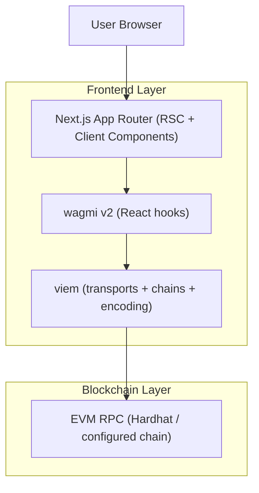

## 1.Architecture design

## 2.Technology Description
- Frontend: Next.js@15 + React@19 + tailwindcss@3
- Web3 (required): wagmi@2 + viem@2 (no ethers/web3.js/thirdweb in the web app)
- Data/cache: @tanstack/react-query@5 (already used by wagmi)
- Backend: None for these pages (direct on-chain reads/writes from client components)

## 3.Route definitions
| Route | Purpose |
|-------|---------|
| / | Home landing page; neon sections + entry points to new flows |
| /search | Search NFTs/authors; results grid and filters |
| /nft-details/[id] | Detailed view of a single NFT (media, metadata, state, primary action) |
| /author | Author profile view (driven by query string such as `?address=`) |
| /upload-nft | Mint/list flow form; wallet required |
| /subscription | Plan selection and subscribe status/CTA |
| /explore | Marketplace feed (existing) |
| /create | Existing mint/list (may be kept or redirected to `/upload-nft` later) |
| /dashboard | Wallet-centric views (existing) |
| /profile | Placeholder (existing) |

## SSR-safe mounted guards (required)
Because the Next.js App Router renders on the server by default, any UI that depends on wallet state (address, chainId, connector availability, window access) must avoid SSR/client hydration mismatches.

Recommended pattern:
- Keep route `page.tsx` as a Server Component when possible.
- Render a dedicated Client Component inside the page (e.g., `<SearchClient />`, `<NftDetailsClient id={params.id} />`).
- Inside client components, use a mounted guard to render deterministic placeholders until the client is mounted.

Example approach (conceptual):
- `useMounted(): boolean` hook using `useEffect(() => setMounted(true), [])`.
- In wallet-dependent UI:
  - Before mount: render skeleton text (e.g., “—”) for address/chain and disable action buttons.
  - After mount: render `useAccount()`, `useChainId()`, `useConnect()`, `useDisconnect()` outputs.

Notes for wagmi v2:
- Keep `createConfig({ ssr: true })` enabled (already present).
- Do not instantiate connectors conditionally in render; define them in config.
- Avoid referencing `window`/`localStorage` during SSR; any such reads must be gated behind the mounted check.

## 4.API definitions (If it includes backend services)
N/A (no backend services).

## 5.Server architecture diagram (If it includes backend services)
N/A.

## 6.Data model(if applicable)
On-chain state only for these pages.
- NFT identity: tokenId (used for `/nft-details/[id]`)
- Listing state: seller, owner, price (read via existing contract read functions already used in Explore/Dashboard)
- Author identity: wallet address (passed via `/author?address=`)

(If you later add off-chain metadata storage for uploads, introduce a backend/storage service then; it is intentionally out of scope here.)