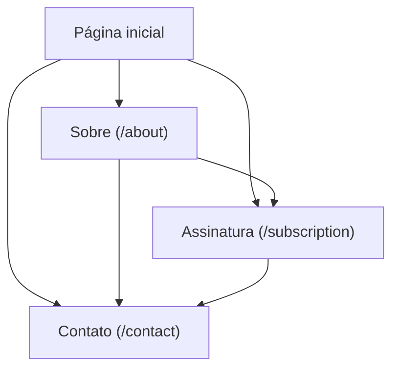

## 1. Product Overview
Melhorar páginas institucionais e de conversão do projeto: **/about**, **/contact** (formulário persistido em MongoDB) e **/subscription**, alinhando **Nav/Footer** a um visual **cyberpunk**.
Foco em clareza, consistência visual e captação de leads via contato.

## 2. Core Features

### 2.1 User Roles
| Role | Registration Method | Core Permissions |
|------|---------------------|------------------|
| Visitante | Não requer | Visualizar /about, /subscription e enviar mensagem em /contact |

### 2.2 Feature Module
Requisitos consistem nas seguintes páginas principais:
1. **Página inicial (existente)**: acesso rápido para /about, /contact e /subscription via Nav/Footer.
2. **Sobre (/about)**: narrativa do projeto, proposta de valor e credibilidade.
3. **Contato (/contact)**: formulário com validação e envio; persistência no MongoDB.
4. **Assinatura (/subscription)**: melhorias de UX/UI para entendimento de planos e CTA.

### 2.3 Page Details
| Page Name | Module Name | Feature description |
|-----------|-------------|---------------------|
| Global (todas as páginas) | Nav (tema cyberpunk) | Exibir navegação principal com estados (hover/active), responsivo e consistente com o tema. |
| Global (todas as páginas) | Footer (tema cyberpunk) | Exibir links essenciais e informações básicas com estilo cyberpunk e boa legibilidade. |
| Página inicial (existente) | Links de entrada | Direcionar para /about, /contact e /subscription a partir do Nav/Footer. |
| /about | Conteúdo institucional | Apresentar propósito do projeto e informações resumidas em seções escaneáveis. |
| /about | CTA contextual | Conduzir para /subscription (principal) e /contact (secundário). |
| /contact | Formulário de contato | Capturar nome, e-mail e mensagem; validar campos; permitir envio. |
| /contact | Persistência (Mongo) | Salvar submissão no MongoDB com data/hora e metadados mínimos. |
| /contact | Feedback de envio | Informar estados: carregando, sucesso e erro; evitar reenvio duplicado. |
| /subscription | Hierarquia e clareza | Melhorar leitura de planos/benefícios e evidenciar ação principal (assinar/gerenciar). |
| /subscription | Estados e confiança | Exibir mensagens de status (ex.: operação em andamento/erro) e microcopy de confiança. |

## 3. Core Process
**Fluxo do Visitante (institucional e conversão)**
1) Você navega pelo site e usa o Nav para acessar **/about** ou **/subscription**.
2) Em **/about**, você entende o projeto e usa o CTA para ir a **/subscription** ou **/contact**.
3) Em **/contact**, você preenche o formulário; o sistema valida e salva a mensagem no MongoDB; você recebe feedback de sucesso/erro.

