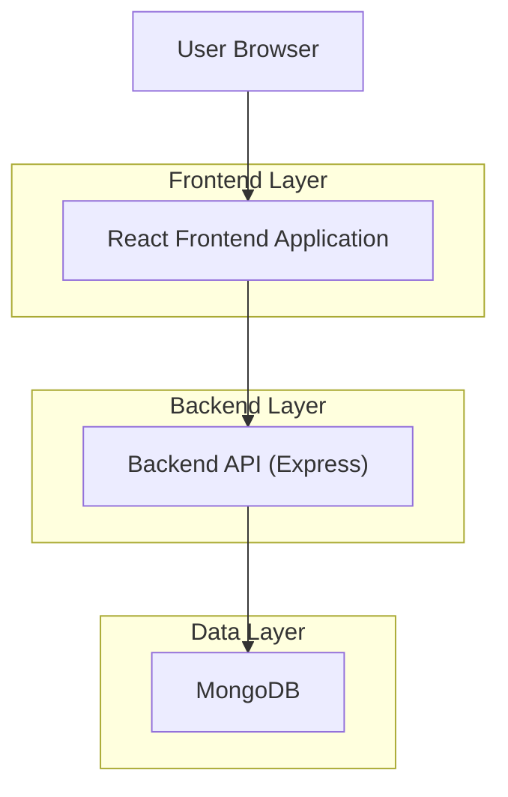
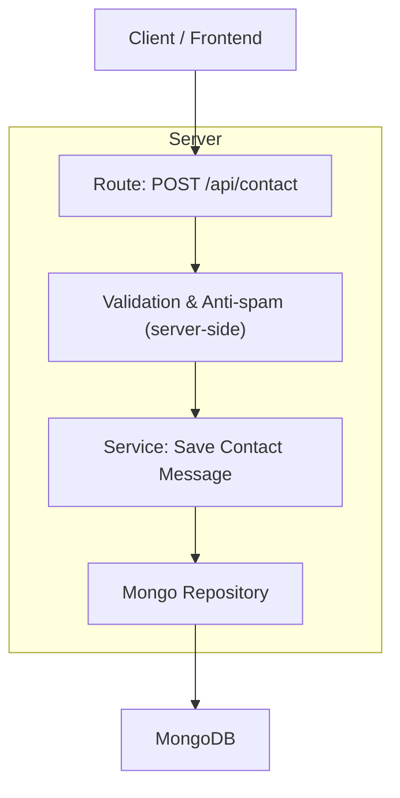
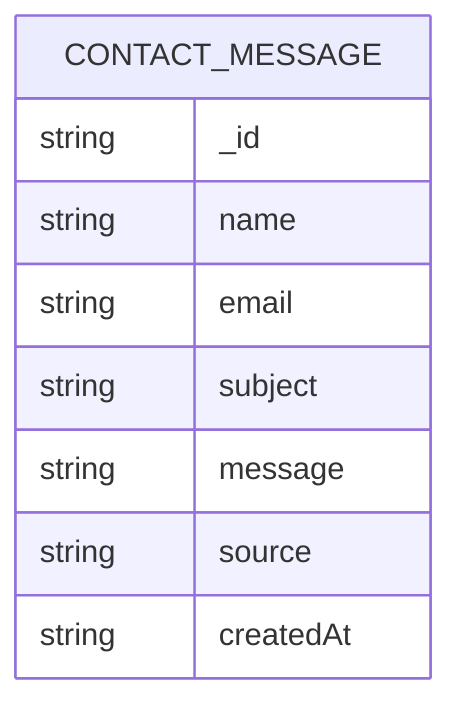

## 1.Architecture design


## 2.Technology Description
- Frontend: React@18 + vite + tailwindcss@3
- Backend: Node.js + Express@4 (rota dedicada para /api/contact)
- Database: MongoDB (coleção de mensagens de contato)

## 3.Route definitions
| Route | Purpose |
|-------|---------|
| / | Página inicial (existente), entrada para /about, /contact, /subscription |
| /about | Página institucional do projeto |
| /contact | Formulário de contato (envia para API e salva no Mongo) |
| /subscription | Página de assinatura com melhorias de UX/UI |

## 4.API definitions (If it includes backend services)
### 4.1 Core API
Enviar mensagem de contato
```
POST /api/contact
```

Request:
| Param Name| Param Type | isRequired | Description |
|----------|------------|-----------|-------------|
| name | string | true | Nome do remetente |
| email | string | true | E-mail válido |
| message | string | true | Conteúdo da mensagem |
| subject | string | false | Assunto (opcional) |

Response:
| Param Name| Param Type | Description |
|----------|------------|-------------|
| ok | boolean | Sucesso da operação |
| id | string | ID do documento salvo |

TypeScript types (compartilháveis):
```ts
export type ContactMessageInput = {
  name: string;
  email: string;
  message: string;
  subject?: string;
};

export type ContactMessageRecord = ContactMessageInput & {
  _id: string;
  createdAt: string; // ISO
  source: "web";
};

export type ContactResponse = { ok: true; id: string } | { ok: false; error: string };
```

## 5.Server architecture diagram (If it includes backend services)


## 6.Data model(if applicable)
### 6.1 Data model definition


### 6.2 Data Definition Language
Mongo (criação lógica + índices):
```js
// collection: contact_messages
// index para consulta por data
db.contact_messages.createIndex({ createdAt: -1 })
// index opcional para triagem por email
db.contact_messages.createIndex({ email: 1, createdAt: -1 })
```
