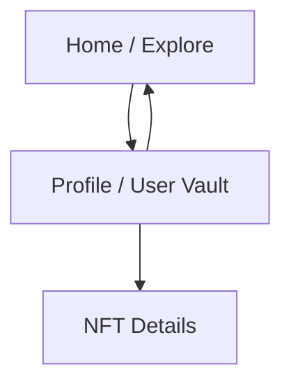

## 1. Product Overview
A Profile/User Vault page that lets you view NFTs owned by a specific wallet address.
It relies on an owner-filtered NFT listing endpoint and uses professional, consistent UI copy.

## 2. Core Features

### 2.1 User Roles
| Role | Registration Method | Core Permissions |
|------|---------------------|------------------|
| Visitor | None | Can access the Profile/User Vault page in read-only mode (view owned NFTs for a given owner address). |

### 2.2 Feature Module
1. **Profile / User Vault**: owner identity header, owned NFT grid, empty/loading/error states, links to NFT details.

### 2.3 Page Details
| Page Name | Module Name | Feature description |
|-----------|-------------|---------------------|
| Profile / User Vault | Owner context | Display the owner identifier (wallet address / profile address) used to filter NFTs. |
| Profile / User Vault | Owned NFT list | Fetch NFTs using the NFT endpoint with an `owner` filter and render a responsive NFT card grid. |
| Profile / User Vault | States & messaging | Show loading indicator; show empty state when no NFTs are owned; show error state with a retry action. |
| Profile / User Vault | Navigation to details | Open an NFT details view when an NFT card is selected. |
| Profile / User Vault | UI copy standard | Use professional English for headings, buttons, helper text, and state messages (no slang; consistent capitalization). |

## 3. Core Process
- User opens the Profile/User Vault page.
- The page determines the owner address (from the current context/route) and requests NFTs filtered by that owner.
- The page renders owned NFTs; if none exist, it shows a clear empty state.
- User selects an NFT to navigate to its details.

