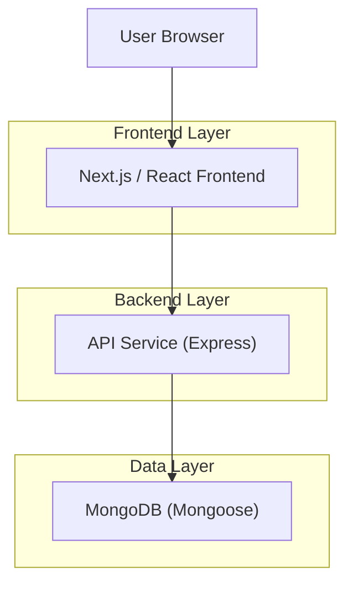
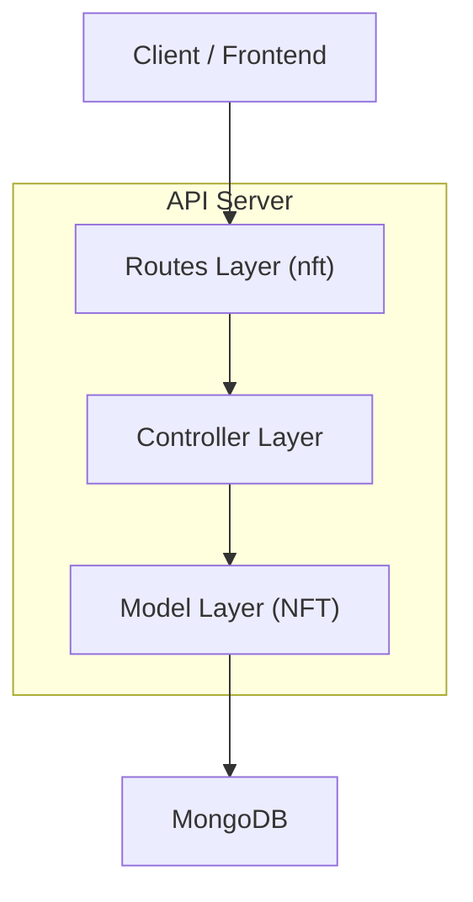
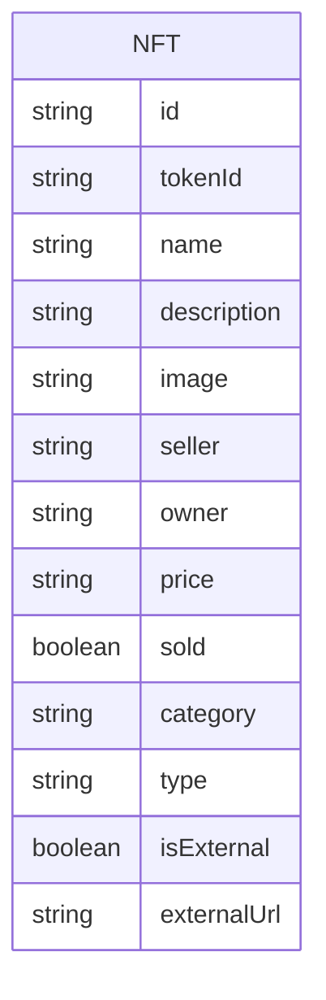

## 1.Architecture design


## 2.Technology Description
- Frontend: React (Next.js App Router) + Tailwind CSS
- Backend: Node.js + Express
- Database: MongoDB + Mongoose

## 3.Route definitions
| Route | Purpose |
|-------|---------|
| /profile | Profile/User Vault page (owned NFT grid for an owner address) |
| /nft-details/[id] | NFT details page (view selected NFT) |
| /explore | General NFT browsing entry point (navigation to Profile/User Vault) |

## 4.API definitions (If it includes backend services)

### 4.1 Core API
NFT listing with owner filtering
```
GET /api/nft?owner={walletAddress}
```

Query:
| Param Name| Param Type | isRequired | Description |
|----------|------------|-----------|-------------|
| owner | string | false | If provided, return only NFTs whose `owner` matches the value (case-insensitive normalization recommended). |

Response (TypeScript types)
```ts
type NFTMediaType = "image" | "audio" | "video";

type NFTDto = {
  id: string;
  tokenId: string;
  name: string;
  description?: string;
  image: string;
  seller: string;
  owner: string;
  price: string;
  sold: boolean;
  category: string;
  type: NFTMediaType;
  isExternal: boolean;
  externalUrl?: string;
};

type ListNftsResponse = {
  items: NFTDto[];
};
```

## 5.Server architecture diagram (If it includes backend services)


## 6.Data model(if applicable)

### 6.1 Data model definition


### 6.2 Data Definition Language
MongoDB collection: `nfts`
- Required field for filtering: `owner: string`
- Suggested index for owner filtering performance: `{ owner: 1 }`